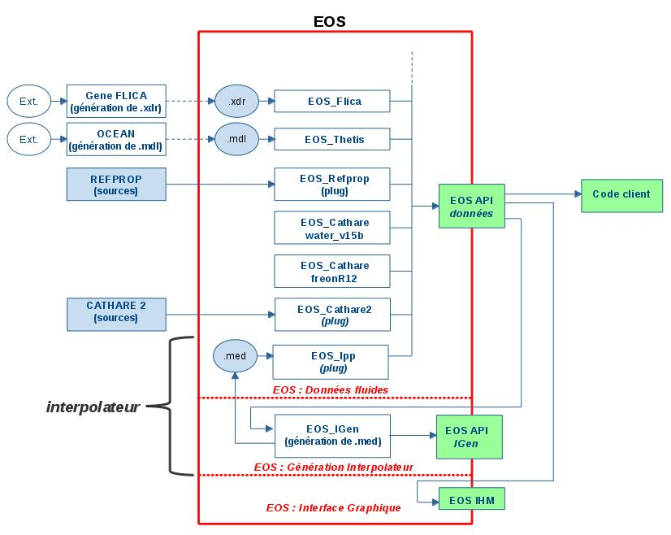
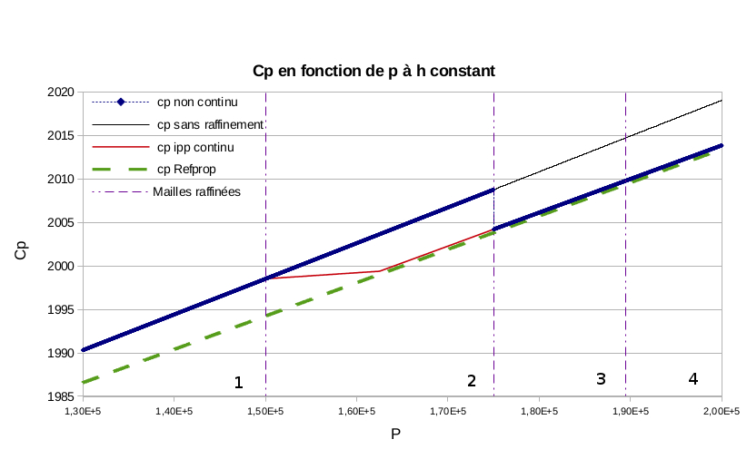
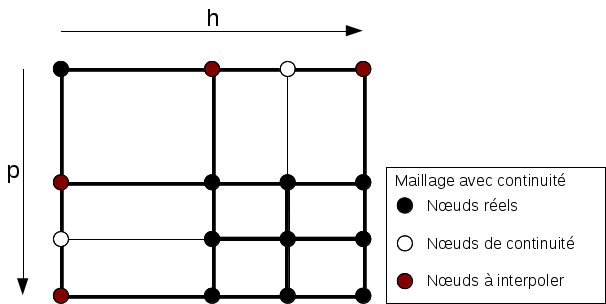
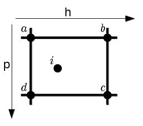

.. _eos-igen:

L'interpolateur (EOS_IGen et EOS_Ipp)
=====================================

Pourquoi tabuler une loi d'état
-------------------------------

Les méthodes thermodynamiques les plus précises sont aussi les plus lentes.
REFPROP résout à chaque appel une équation fondamentale en énergie libre de
Helmholtz, avec itérations internes dès que les variables d'entrée ne sont pas
ses variables naturelles ; obtenir l'ensemble des propriétés d'un point du
plan :math:`(p,h)` lui demande de l'ordre de 50 ms. Un code de
thermohydraulique, lui, demande une dizaine de propriétés et leurs dérivées
dans chaque maille, à chaque itération de chaque pas de temps : à ce rythme,
la loi d'état devient le premier poste de coût du calcul, loin devant la
résolution des équations de bilan.

L'interpolateur répond à ce problème par une tabulation. On calcule une fois
pour toutes, avec la méthode de référence, les propriétés aux nœuds d'un
maillage du plan :math:`(p,h)` ; on enregistre le résultat dans un fichier ;
et le code de calcul n'évalue plus ensuite qu'un polynôme par maille, dont le
coût est sans commune mesure et ne dépend plus de la méthode d'origine. Le
prix à payer est une erreur d'interpolation, que l'on maîtrise de deux
façons : en raffinant le maillage là où la propriété varie vite, et en
utilisant une interpolation d'ordre élevé.

Le travail est réparti entre deux composants, que la figure
:ref:`ci-dessous <fig-igen-principe>` situe dans la bibliothèque. Le module
``Modules/EOS_IGen`` est le *générateur* : il construit le maillage, le
raffine et écrit la table au format MED. La méthode thermodynamique
``EOS_Ipp`` du module EOS (``Modules/EOS/Src/EOS_Ipp``) est le *lecteur* :
elle charge une table et se comporte ensuite comme n'importe quelle autre
méthode, derrière la façade :cpp:class:`NEPTUNE::EOS`. Un code client n'a donc
rien à modifier pour passer de REFPROP à une table construite sur REFPROP,
sinon deux chaînes de caractères.

.. _fig-igen-principe:

   Place de l'interpolateur dans EOS : EOS_IGen produit des fichiers ``.med``
   à partir d'une méthode quelconque, EOS_Ipp les relit (schéma de la
   documentation de 2013 ; l'outil de tuilage décrit plus bas n'y figure pas).

Les deux composants ne sont compilés que si la bibliothèque est configurée
avec ``--with-interpolator`` (option CMake ``WITH_IPP``), ce qui exige MED et
HDF5 (``--with-med=<chemin>``, ``--with-hdf5=<chemin>``) ; voir
:doc:`../installation`.

Vue d'ensemble de la chaîne
---------------------------

Du point de vue de l'utilisateur, tout tient en sept appels côté génération
et deux côté utilisation :

.. code-block:: c++

   // --- génération (une fois) ---------------------------------------
   EOS_IGen igen("EOS_Refprop10", "WaterLiquid");
   igen.set_extremum(1.0e7, 2.0e7, 300., 500.);   // pmin, pmax, Tmin, Tmax
   igen.make_mesh(5, 5, 3);                       // 5 x 5 noeuds, 3 niveaux au plus
   igen.set_quality("T", "centre", 0, 1.e-6, 3);  // erreur relative sur T < 1e-6
   igen.make_local_refine();                      // raffinement adaptatif
   AString nom("eau_liquide_refprop10");
   igen.set_file_med_name(nom);
   igen.write_med();

   // --- utilisation (dans le code de calcul) -------------------------
   EOS eau("EOS_Ipp", "eau_liquide_refprop10");
   eau.compute_T_ph(p, h, T);

Le diagramme de séquence :ref:`suivant <fig-igen-sequence>` montre ce que ces
appels déclenchent. Les sections qui suivent le reprennent étape par étape.

.. _fig-igen-sequence:

.. graphviz::
   :caption: Séquence génération, écriture, lecture, évaluation. À gauche le
             programme de génération et EOS_IGen, au centre le répertoire de
             données, à droite le code de calcul et EOS_Ipp.

   digraph igen_sequence {
       rankdir=TB;
       node [shape=box, fontname="Helvetica", fontsize=10,
             style=filled, fillcolor="#eef3fa"];
       edge [fontname="Helvetica", fontsize=9];

       subgraph cluster_gen { label="Génération (EOS_IGen)"; color="#bbbbbb";
           g1 [label="1. set_extremum(pmin, pmax, Tmin, Tmax)"];
           g2 [label="2. make_mesh(np, nh, level_max)\nnew EOS(méthode, référence) ; h(p,T) aux 4 coins\nEOS_Mesh 2D (p,h) et EOS_Mesh 1D (p)"];
           g3 [label="3. set_quality(prop, type, is_abs, seuil, nb_sub)\nEOS_IGen_QI ajouté"];
           g4 [label="4. make_local_refine(cont)"];
           g5 [label="4a. compute_qualities()\ntable temporaire + EOS(\"EOS_Ipp\", temporaire)\ncomparaison interpolé / référence par maille"];
           g6 [shape=diamond, fillcolor="#fff6d6", label="critères satisfaits\nou level_max atteint ?"];
           g7 [label="4b. EOS_Mesh::add_local_nodes(level, cont)\nEOS_Mesh::add_continuity_nodes(level)"];
           g8 [label="5. write_med()\ntoutes les propriétés aux noeuds\nEOS_Med : maillages, champs, scalaires"];
       }
       subgraph cluster_data { label="Répertoire de données EOS"; color="#bbbbbb";
           d1 [shape=note, fillcolor="#e8f5e2", label="EOS_Ipp/<nom>.med"];
           d2 [shape=note, fillcolor="#e8f5e2", label="index.eos\nIpp <nom> EOS_Ipp_liquid ..."];
       }
       subgraph cluster_use { label="Utilisation (EOS_Ipp)"; color="#bbbbbb";
           u1 [label="6. EOS eau(\"EOS_Ipp\", \"<nom>\")\nlecture de index.eos, init(\"<nom>.med\")"];
           u2 [label="7. load_from_med_path()\nnoeuds, champs, scalaires\nEOS_Ipp_CellLocator ; retrace_hanging_nodes()"];
           u3 [label="8. compute_T_ph(p, h, T)\ncompute_prop_ph : bornes, get_cellidx(p,h)"];
           u4 [label="9. bicubic_evaluate() ou bilinear_interpolator()"];
       }
       g1 -> g2 -> g3 -> g4 -> g5 -> g6;
       g6 -> g7 [label="non"];
       g7 -> g5;
       g6 -> g8 [label="oui"];
       g8 -> d1; g8 -> d2;
       d2 -> u1; d1 -> u2;
       u1 -> u2 -> u3 -> u4;
   }

Générer une table
-----------------

Le domaine et le maillage initial
~~~~~~~~~~~~~~~~~~~~~~~~~~~~~~~~~

Le générateur est la classe :cpp:class:`NEPTUNE_EOS_IGEN::EOS_IGen`. On lui
donne la méthode de référence et l'équation fluide, soit au constructeur, soit
par ``set_method`` et ``set_reference``. Le nom de l'équation doit contenir
« Liquid » ou « Vapor » (la casse est indifférente) : c'est ce qui décide, à
la relecture, de la classe instanciée, ``EOS_Ipp_liquid`` ou
``EOS_Ipp_vapor``. Une référence comme ``"Water"`` fait échouer la génération
avec le message *« State Equation name not found »*.

Le domaine se spécifie en pression et en **température**,
``set_extremum(pmin, pmax, Tmin, Tmax)``, parce que c'est ainsi qu'un
ingénieur le connaît. Mais la table est construite dans le plan
:math:`(p,h)`, qui est celui des codes de calcul. ``make_mesh`` fait la
conversion en évaluant :math:`h(p,T)` aux quatre coins du rectangle
:math:`(p,T)` ; la plus petite et la plus grande des quatre valeurs deviennent
:math:`h_{min}` et :math:`h_{max}`. Les températures ne servent plus ensuite
qu'à renseigner l'en-tête du fichier. Deux conséquences : les quatre coins
doivent être calculables par la méthode de référence, sans quoi ``make_mesh``
renvoie une erreur ; et le rectangle :math:`(p,h)` obtenu déborde en général
du domaine :math:`(p,T)` demandé, puisque les isothermes ne sont pas des
droites verticales du plan :math:`(p,h)`.

``make_mesh(nb_p, nb_h, level_max)`` crée deux maillages :

* un maillage **2D** du plan :math:`(p,h)`, grille régulière de
  ``nb_p`` × ``nb_h`` nœuds à pas constants
  :math:`\Delta p = (p_{max}-p_{min})/(nb_p-1)` et
  :math:`\Delta h = (h_{max}-h_{min})/(nb_h-1)`, qui portera les propriétés
  thermodynamiques et de transport ;
* un maillage **1D** en pression, de ``nb_p`` nœuds, qui portera à la fois la
  courbe de saturation et les limites spinodales.

On peut ne créer que l'un ou l'autre avec ``make_mesh_ph`` et ``make_mesh_p``.
Le maillage 2D est un rectangle plein : il n'a aucune notion de phase. Si une
partie du rectangle tombe hors du domaine de validité de la méthode — de
l'autre côté de la courbe de saturation, par exemple — les nœuds concernés
reçoivent le code d'erreur renvoyé par la méthode, qui est enregistré dans la
table et restitué à l'évaluation. Il vaut mieux l'éviter en choisissant un
domaine contenu dans la phase visée.

Le troisième argument, ``level_max``, borne le nombre de passes de
raffinement. Sa valeur par défaut, −1, signifie **« pas de borne »** et non
« pas de raffinement » : avec un seuil de qualité trop ambitieux, le
raffinement ne s'arrêterait qu'à l'épuisement de la mémoire. Il faut toujours
fixer ``level_max`` dès que l'on raffine.

Le critère de qualité
~~~~~~~~~~~~~~~~~~~~~

Raffiner suppose de savoir mesurer l'erreur. Un critère de qualité
(:cpp:class:`NEPTUNE_EOS_IGEN::EOS_IGen_QI`) se déclare par

.. code-block:: c++

   igen.set_quality(propriete, type, is_abs, seuil, nb_sub);

et se lit : « dans chaque maille, l'écart entre la valeur interpolée de
``propriete`` et sa valeur de référence ne doit pas dépasser ``seuil`` ».
L'écart est absolu, :math:`|f_{ipp} - f_{ref}|`, si ``is_abs`` vaut 1, et
relatif, :math:`|f_{ipp} - f_{ref}|/|f_{ref}|`, s'il vaut 0. On peut déclarer
plusieurs critères, sur des propriétés du plan :math:`(p,h)` comme sur des
propriétés de saturation (qui pilotent alors le maillage 1D) ; une maille est
raffinée dès que l'un d'eux échoue.

Reste à dire *où* l'écart est mesuré. Avec le type ``"centre"``, le seul
employé en pratique, la maille est découpée en ``nb_sub`` × ``nb_sub``
sous-mailles et l'écart est évalué au centre de chacune ; la maille est
rejetée si un seul de ces points dépasse le seuil. Avec ``nb_sub = 1``, valeur
par défaut, on ne teste que le centre de la maille, ce qui ne borne pas
l'erreur : pour une interpolation cubique, le maximum de l'erreur n'est pas au
centre, et l'on a mesuré des tables livrées à :math:`1{,}3\cdot10^{-6}` pour
un seuil demandé de :math:`10^{-6}`. Avec ``nb_sub = 3``, soit neuf points par
maille, la même table tient :math:`8\cdot10^{-7}`, et aller au-delà n'apporte
plus rien. La recommandation est donc ``nb_sub = 3``. Les valeurs paires sont
déconseillées (aucun point ne tombe alors au centre, là où l'erreur bilinéaire
est maximale) et déclenchent un avertissement. Le type ``"node"`` mesure
l'écart aux nœuds du maillage ; il n'est exercé par aucun test.

.. warning::

   Un seuil négatif ou nul — et c'est le cas de la valeur par défaut,
   −9999,9 — signifie « pas de seuil » : le critère est calculé et affiché,
   mais ne rejette jamais aucune maille. ``set_quality("rho", "centre", 1)``
   suivi de ``make_local_refine()`` ne raffine donc rien.

Pour mesurer l'écart, ``compute_qualities`` a besoin d'un interpolateur sur le
maillage courant. Il l'obtient de la façon la plus directe : il écrit une
table temporaire (``mesh_ph_p_<pid>.med``), l'ouvre avec
``EOS("EOS_Ipp", …)``, et compare ce lecteur à la méthode de référence aux
points de test. L'erreur contrôlée est donc exactement celle que verra
l'utilisateur, bicubique compris. Pour ne pas payer à chaque passe le calcul
de la centaine de champs d'une table complète, la table temporaire ne contient
sur le plan :math:`(p,h)` que ce que les critères lisent : la propriété
contrôlée, ses deux dérivées premières et sa dérivée croisée. Avec REFPROP, à
50 ms le nœud, c'est cette économie qui rend le raffinement praticable. Les
tables temporaires et leurs lignes dans ``index.eos`` ne sont pas supprimées
en fin de génération ; un nettoyage périodique du répertoire de données est à
prévoir.

Raffinement global et raffinement local
~~~~~~~~~~~~~~~~~~~~~~~~~~~~~~~~~~~~~~~

Les deux procédures ont la même boucle : évaluer les critères ; s'ils ne sont
pas tous satisfaits et que ``level_max`` n'est pas atteint, raffiner et
recommencer.

``make_global_refine()`` raffine **tout** le maillage dès qu'une seule maille
échoue : le nombre de nœuds passe de :math:`n` à :math:`2n-1` dans chaque
direction, chaque maille étant coupée en quatre. Le maillage reste une grille
régulière, l'interpolation y est continue par construction, mais le nombre de
nœuds est multiplié par quatre à chaque passe, y compris là où c'était
inutile.

``make_local_refine(cont)`` ne raffine que les mailles rejetées. C'est le mode
à préférer : près du point critique ou de la saturation, les propriétés
varient bien plus vite qu'ailleurs, et un maillage adapté atteint la même
précision avec nettement moins de nœuds. Dans l'exemple du test de
non-régression (eau liquide REFPROP 9, 5 × 5 nœuds au départ), le maillage
passe de 25 à 72 puis 137 nœuds en raffinement local, contre 81 puis 289 en
global.

Les nœuds du maillage raffiné vivent sur une grille *virtuelle*, celle du pas
le plus fin atteint : au niveau :math:`n`, elle compte
:math:`2^n (nb_h - 1) + 1` positions par ligne, dont la plupart restent
vides. Les mailles réelles sont les rectangles de cette grille qui ne
contiennent aucun nœud intérieur ; le générateur les retrouve par une
décomposition en quadtree. Un détail de l'algorithme surprend à la première
lecture : une maille rejetée n'est pas coupée en quatre mais raffinée d'emblée
jusqu'au pas le plus fin de la grille courante. Une maille restée grossière
(de côté :math:`k` pas fins) alors que ses voisines ont déjà été raffinées
donne donc :math:`4k^2` mailles d'un coup.

Si une passe laisse le maillage dans un état incohérent, le générateur le
détecte (``EOS_Mesh::refine_ok()``), s'arrête avec le message *« the mesh
could not be refined past level … »* et n'écrit rien : on ne peut pas produire
une table fausse par ce biais.

Nœuds pendants et nœuds de continuité
~~~~~~~~~~~~~~~~~~~~~~~~~~~~~~~~~~~~~

Le raffinement local crée une difficulté que le raffinement global ignore.
Quand une maille fine jouxte une maille grossière, les nœuds de la maille fine
qui tombent au milieu de l'arête commune n'appartiennent pas à la maille
grossière : ce sont des *nœuds pendants*. De part et d'autre de l'arête, la
propriété est alors interpolée à partir de données différentes — trois nœuds
d'un côté, deux de l'autre — et les deux interpolations ne coïncident pas :
la propriété est **discontinue** à la traversée de l'arête.

La figure :ref:`ci-dessous <fig-igen-cp>`, tirée de la documentation de 2013,
montre l'effet sur :math:`c_p(p)` à enthalpie constante. La courbe bleue
(raffinement sans traitement) saute à la frontière entre les zones 2 et 3, là
où l'on passe d'une maille grossière à une maille fine ; la courbe rouge
(raffinement avec continuité) se raccorde. Pour un solveur implicite, un tel
saut est pire qu'une erreur : il peut empêcher la convergence d'un Newton dont
l'itéré oscille de part et d'autre.

.. _fig-igen-cp:

   :math:`c_p(p)` à :math:`h` constant au travers de quatre mailles : sans
   raffinement (noir), raffiné sans continuité (bleu), raffiné avec continuité
   (rouge), référence REFPROP (vert). Figure historique.

Le remède, appliqué par ``EOS_Mesh::add_continuity_nodes`` lorsque
``cont = true`` (le défaut), consiste à **couper la maille grossière** : tout
nœud réel situé strictement à l'intérieur d'une arête d'une maille coupe cette
maille perpendiculairement à l'arête, de sorte que chaque nœud pendant
devienne le coin de mailles des deux côtés. Pour fermer la coupe, il faut des
nœuds là où il n'y en avait pas : à l'extrémité opposée de chaque coupe, et
aux croisements d'une coupe horizontale et d'une coupe verticale. Ce sont les
*nœuds de continuité*, de trois types : type 1 sur une arête verticale, type 2
sur une arête horizontale, type 3 à un croisement.

.. _fig-igen-ct:

   Maillage raffiné localement. Le quart inférieur droit a été raffiné ; les
   nœuds blancs sont les nœuds de continuité qui ferment les coupes imposées
   aux mailles voisines, les nœuds rouges ceux dont la valeur est imposée
   par interpolation.

Couper ne suffit pas : encore faut-il que la valeur portée par un nœud situé
sur une arête soit celle que l'interpolation de la maille voisine donne à cet
endroit. Pour un nœud de type 1 ou 2, placé entre les extrémités :math:`A` et
:math:`B` de l'arête, le générateur n'enregistre donc pas la valeur de la
méthode de référence, mais l'interpolation linéaire à la position réelle du
nœud,

.. math::

   f_M = (1-s)\,f_A + s\,f_B, \qquad s = \frac{x_M - x_A}{x_B - x_A},

qui est la trace de l'interpolation bilinéaire sur l'arête. Ce n'est pas
toujours la demi-somme : dès le troisième niveau de raffinement, des nœuds
pendants apparaissent au quart ou aux trois quarts d'une arête. Les nœuds de
type 3, intérieurs, gardent la valeur de référence. La table mémorise le type
de chaque nœud et les deux extrémités de son arête (champs entiers
``CNT_TYPE``, ``CNT_SUP0``, ``CNT_SUP1``), ce qui permet au lecteur, s'il
travaille en bicubique, de remplacer cette valeur linéaire par la trace
cubique correspondante ; on y revient plus bas.

Après chaque passe, un contrôle d'invariants vérifie que chaque coin de maille
porte un nœud, que chaque nœud de continuité est bien sur une arête ou à un
croisement, et que chaque coupe se ferme sur un nœud.

L'écriture de la table
~~~~~~~~~~~~~~~~~~~~~~

``write_med()`` évalue la méthode de référence en tous les nœuds, pour toutes
les propriétés, et écrit le fichier
``<données>/EOS_Ipp/<nom>.med``, où ``<données>`` est le répertoire de données
d'EOS (``NEPTUNE_EOS_DATA``, à défaut ``USER_EOS_DATA``, à défaut le
répertoire fixé à l'installation) et ``<nom>`` celui donné par
``set_file_med_name``. Sans nom explicite, le générateur en fabrique un à
partir de la méthode et des bornes, peu maniable.

Le fichier est un MED ordinaire (HDF5), lisible dans SALOME ou ParaView, ce
qui est commode pour contrôler visuellement un maillage raffiné. Il contient :

* trois maillages non structurés : ``ph_domain`` (2D, coordonnées
  :math:`h` puis :math:`p`, une maille quadrangle par rectangle réel),
  ``sat_domain`` et ``lim_domain`` (1D, en pression) ;
* pour chaque propriété un champ réel aux nœuds, nommé par le nom interne
  compacté de la propriété (``t``, ``rho``, ``cp``, ``dtdph``,
  ``d2cpdpdh``…), et un champ entier ``IE <nom>`` portant le code d'erreur de
  la méthode de référence en chaque nœud ;
* en cas de raffinement local, les trois champs ``CNT_*`` ;
* onze scalaires : les bornes ``pmin``, ``pmax``, ``hmin``, ``hmax``,
  ``tmin``, ``tmax``, les pas de la grille la plus fine ``delta_p`` et
  ``delta_h``, et le point critique ``pcrit``, ``hcrit``, ``tcrit``.

Par défaut sont écrites toutes les propriétés de la nomenclature
(:doc:`../usage/properties`) que la méthode déclare savoir calculer : les
grandeurs :math:`T, \rho, u, s, \mu, \lambda, c_p, c_v, \sigma, w, g, f, Pr,
\beta, \gamma`, leurs dérivées premières en :math:`(p,h)` et en :math:`(p,T)`,
leurs dérivées croisées, la saturation et ses dérivées, les limites
spinodales. Une propriété non implémentée est omise sans message. Pour une
table plus légère, ``set_list_propi``, ``set_list_propi_sat`` et
``set_list_propi_lim`` restreignent les listes ; il faut alors penser à
inclure, pour chaque grandeur que l'on veut interpoler en bicubique, ses
dérivées ``d_X_d_p_h`` et ``d_X_d_h_p``, et si possible ``d2_X_d_p_d_h``.

Peu de méthodes fournissent la dérivée croisée
:math:`\partial^2 f/\partial p\,\partial h`. Lorsqu'elle manque, le générateur
la construit lui-même en dérivant numériquement le champ
:math:`(\partial f/\partial p)_h` le long de :math:`h` sur les nœuds du
maillage, par une formule à trois points à pas inégaux (décentrée au bord), en
ignorant les nœuds de continuité.

Enfin ``write_med`` inscrit la table dans les fichiers d'index, par une ligne
de la forme

.. code-block:: text

   Ipp eau_liquide_refprop10 EOS_Ipp_liquid WaterLiquid Unknown 1 eau_liquide_refprop10.med

dans ``<données>/index.eos`` et ``<données>/EOS_Ipp/index.eos``. C'est elle
qui rend la table accessible par son nom. Le second fichier doit exister au
préalable, fût-il vide — c'est le rôle du fichier livré dans
``Modules/EOS/Data/EOS_Ipp``.

Utiliser une table
------------------

Ouverture
~~~~~~~~~

.. code-block:: c++

   EOS eau("EOS_Ipp", "eau_liquide_refprop10");

La façade cherche dans ``index.eos`` la ligne ``Ipp eau_liquide_refprop10``,
instancie la classe indiquée et lui passe le nom du fichier. Le répertoire de
données doit donc être le même qu'à la génération. Deux variantes existent.
On peut ne charger que certaines propriétés, ce qui réduit l'empreinte
mémoire :

.. code-block:: c++

   Strings liste(3);
   liste[0] = "T";  liste[1] = "d_T_d_p_h";  liste[2] = "d_T_d_h_p";
   EOS eau("EOS_Ipp", "eau_liquide_refprop10", liste);

Et l'on peut désigner directement un fichier, sans passer par l'index, avec
des options séparées par ``:`` :

.. code-block:: c++

   Strings args(1);
   args[0] = "eau_liquide_refprop10.med:bilinear";
   EOS eau("EOS_Ipp", args);

Les options reconnues sont ``bicubic``, ``bilinear``, et pour les bases
tuilées ``cache=<taille>`` et ``tiles=<nombre>``.

Au chargement, ``EOS_Ipp`` lit les nœuds, les champs et les scalaires,
convertit les codes d'erreur par nœud en codes par maille (une maille hérite
de la pire erreur de ses quatre sommets), puis prépare la localisation.

Localiser la maille
~~~~~~~~~~~~~~~~~~~

Trouver la maille qui contient :math:`(p,h)` doit être beaucoup plus rapide
que l'interpolation elle-même. ``EOS_Ipp`` tire parti de la grille virtuelle :
une division entière donne les indices du point sur la grille la plus fine,

.. math::

   i_p = \left\lfloor \frac{p - p_{min}}{\delta_p} \right\rfloor, \qquad
   i_h = \left\lfloor \frac{h - h_{min}}{\delta_h} \right\rfloor,

et il reste à savoir quelle maille réelle recouvre la case :math:`(i_p, i_h)`.
C'est le rôle de la classe ``EOS_Ipp_CellLocator``, un quadtree
construit en espace d'indices à partir de la boîte englobante de chaque maille
du fichier ; la descente se fait en lisant un bit de :math:`i_p` et un bit de
:math:`i_h` par niveau. Sa taille est proportionnelle au nombre de mailles
réelles. La documentation de 2013 décrivait à sa place une table plate
donnant une maille pour chaque case de la grille virtuelle ; cette table
croît comme :math:`4^{level\_max}` (41 Mo au niveau 5 pour une base 101 × 101,
2,6 Go au niveau 8) et n'est plus conservée, comme accélérateur, que tant
qu'elle tient dans 16 Mo (variable ``EOS_IPP_FLAT_INDEX_MAX_MB``). Un cache
local au *thread* mémorise en outre la dernière maille visitée, ce qui profite
aux appels successifs en des points voisins.

Les méthodes d'interpolation
~~~~~~~~~~~~~~~~~~~~~~~~~~~~

Deux méthodes sont disponibles dans le plan :math:`(p,h)`. On note
:math:`a, b, c, d` les coins de la maille comme sur la figure
:ref:`ci-dessous <fig-igen-maille>`, et
:math:`t = (p - p_a)/(p_d - p_a)`, :math:`u = (h - h_a)/(h_b - h_a)` les
coordonnées réduites du point.

.. _fig-igen-maille:

   Une maille du plan :math:`(p,h)` et ses quatre coins :
   :math:`a = (p_{min}, h_{min})`, :math:`b = (p_{min}, h_{max})`,
   :math:`c = (p_{max}, h_{max})`, :math:`d = (p_{max}, h_{min})`.

**Bilinéaire.** C'est la méthode d'origine :

.. math::

   f(t,u) = (1-t)(1-u)\,f_a + (1-t)\,u\,f_b + t\,u\,f_c + t\,(1-u)\,f_d .

Elle ne demande que les valeurs aux nœuds. L'erreur décroît comme le carré du
pas, et l'interpolée est continue mais pas dérivable à la traversée des
arêtes. Chaque propriété est interpolée indépendamment : :math:`\rho` et
:math:`(\partial\rho/\partial p)_h` sortent de deux champs distincts, et la
seconde n'est pas la dérivée de la première.

**Bicubique.** C'est la méthode par défaut. Sur chaque maille, la propriété
est représentée par un carreau de Hermite, produit tensoriel de cubiques, qui
interpole aux quatre coins non seulement la valeur mais aussi les deux
dérivées premières et la dérivée croisée :

.. math::

   f(t,u) = \sum_{k \in \{a,b,c,d\}} \Bigl[
        H_{i_k}(t)\,H_{j_k}(u)\, f_k
      + K_{i_k}(t)\,H_{j_k}(u)\, \Delta p\,\Bigl(\frac{\partial f}{\partial p}\Bigr)_k
      + H_{i_k}(t)\,K_{j_k}(u)\, \Delta h\,\Bigl(\frac{\partial f}{\partial h}\Bigr)_k
      + K_{i_k}(t)\,K_{j_k}(u)\, \Delta p\,\Delta h\,
        \Bigl(\frac{\partial^2 f}{\partial p\,\partial h}\Bigr)_k \Bigr],

où :math:`(i_k, j_k) \in \{0,1\}^2` repère le coin (:math:`i = 0` en
:math:`p_{min}`, :math:`j = 0` en :math:`h_{min}`) et où les fonctions de base
de Hermite sont

.. math::

   H_0(x) = 2x^3 - 3x^2 + 1, \quad H_1(x) = -2x^3 + 3x^2, \quad
   K_0(x) = x^3 - 2x^2 + x, \quad K_1(x) = x^3 - x^2 .

Le point essentiel est l'origine des dérivées : elles ne sont pas estimées par
différences entre nœuds, comme dans une spline, mais **lues dans la table**,
où le générateur a enregistré les dérivées exactes fournies par la méthode de
référence. La correspondance est fixée par ``EOS_Ipp_BicubicProps.hxx`` : pour
une grandeur ``X`` parmi :math:`T, \rho, u, s, \mu, \lambda, c_p, c_v, \sigma,
w, g, f, Pr, \beta, \gamma`, le carreau utilise les champs ``d_X_d_p_h``,
``d_X_d_h_p`` et ``d2_X_d_p_d_h``. L'erreur décroît comme la puissance
quatrième du pas, l'interpolée est de classe :math:`C^1` sur un maillage
régulier, et la grandeur est cohérente avec ses dérivées aux nœuds. À
précision égale, une table bicubique a besoin de beaucoup moins de nœuds ; le
tableau comparatif de :ref:`python-interpolateur` donne des ordres de
grandeur (deux à quatre décades d'erreur en moins à maillage égal).

Le coût d'une évaluation bicubique tient pour l'essentiel à la construction
du carreau (seize coefficients à partir de seize données), non à la lecture
des données ni à l'évaluation du polynôme ; le cache de dernière maille
conserve le carreau construit, de sorte qu'une rafale de points dans la même
maille ne le paie qu'une fois.

Si la table ne contient pas les deux dérivées premières d'une propriété,
celle-ci est interpolée en bilinéaire, **sans avertissement** ; c'est aussi le
cas des propriétés qui sont elles-mêmes des dérivées (``d_T_d_p_h``…), qui
n'ont pas de carreau. Si seule la dérivée croisée manque, elle est estimée
localement à partir des dérivées premières aux quatre coins. Depuis
l'API Python, ``has_bicubic_first_derivative_data`` et
``has_bicubic_cross_derivative_data`` permettent de savoir ce qu'il en est.

On change de méthode à l'ouverture (suffixe ``:bilinear``) ou par programme,
avec ``EOS_Ipp::set_interpolation_method``. Cette méthode n'appartient pas à
l'interface d'``EOS_Fluid`` : en C++ on l'atteint par un ``dynamic_cast`` de
``eau.fluid()`` vers ``EOS_Ipp``, et c'est ce que fait pour vous la méthode
de même nom d'``EOS_py`` en Python.

**Nœuds pendants en bicubique.** Le générateur a écrit aux nœuds de type 1 et
2 une valeur interpolée linéairement, qui assure la continuité en bilinéaire
mais pas en bicubique, où la trace du carreau voisin sur l'arête est une
cubique. Au chargement, si la méthode active est la bicubique,
``retrace_hanging_nodes`` remplace donc, pour chaque nœud pendant et chaque
propriété pourvue de dérivées, la valeur par la cubique de Hermite de l'arête
:math:`A`–:math:`B` prise à l'abscisse réelle du nœud, et la dérivée
tangentielle par la pente de cette cubique. La valeur portée par un nœud
pendant dépend donc de la méthode d'interpolation, et ce recalage est fait une
fois pour toutes au chargement : pour comparer proprement les deux méthodes
sur une table raffinée localement, mieux vaut ouvrir la table deux fois que
basculer en cours de route.

Saturation, limites spinodales et plan (p,T)
~~~~~~~~~~~~~~~~~~~~~~~~~~~~~~~~~~~~~~~~~~~~

Les propriétés à une variable (``T_sat``, ``h_l_sat``, ``h_v_sat``,
``rho_l_sat``…, ``h_l_lim``, ``h_v_lim`` et leurs dérivées en pression) sont
interpolées **linéairement** sur le maillage 1D, quelle que soit la méthode
retenue en 2D. Elles sont définies entre :math:`p_{min}` et le minimum de
:math:`p_{max}` et de la pression critique.

La table n'existe que dans le plan :math:`(p,h)`. Un appel dans le plan
:math:`(p,T)`, ``compute_rho_pT`` par exemple, commence par inverser
:math:`T(p,h)` pour trouver :math:`h`, puis évalue la propriété en
:math:`(p,h)`. L'inversion ne parcourt que les mailles de la colonne de
pression concernée, en écartant d'emblée celles dont l'encadrement en
température ne contient pas :math:`T`. Dans une maille, à :math:`p` fixé,
:math:`T(u)` est une fonction affine en bilinéaire, inversée directement, et
une cubique en bicubique, résolue en forme fermée. Un calcul en :math:`(p,T)`
coûte donc nettement plus cher qu'un calcul en :math:`(p,h)` ; pour un appel
par champs, l'inversion n'est faite qu'une fois par point, quel que soit le
nombre de propriétés demandées. Si aucune maille ne fournit de racine,
l'erreur ``INVERT_h_pT`` est renvoyée.

Hors du domaine, et le modèle de secours
~~~~~~~~~~~~~~~~~~~~~~~~~~~~~~~~~~~~~~~~

``EOS_Ipp`` n'extrapole jamais. Un point hors du rectangle de la table, ou
dans le rectangle mais sur aucune maille, reçoit un code d'erreur propre à la
méthode (voir :doc:`../usage/errors` pour le mécanisme général) :

.. list-table:: Codes d'erreur internes d'``EOS_Ipp``
   :header-rows: 1
   :widths: 30 12 14 44

   * - Constante
     - Code
     - Gravité
     - Signification
   * - ``EOS_Ipp::OUT_OF_BOUNDS``
     - 1000
     - ``bad``
     - Point hors du domaine d'interpolation
   * - ``EOS_Ipp::INVERT_h_pT``
     - 1001
     - ``error``
     - L'inversion :math:`h(p,T)` n'a pas trouvé de racine
   * - ``EOS_Ipp::PROP_NOT_IN_DB``
     - 1002
     - ``error``
     - Propriété absente de la table
   * - ``EOS_Ipp::MODEL_NOT_INIT``
     - 1003
     - ``error``
     - Opération demandant un modèle de référence non attaché

Tout autre code est une erreur rencontrée par la méthode de référence lors de
la génération et enregistrée dans la table ; ``describe_error`` l'annonce par
*« Error occured to database production with … method »*.

Pour un code de calcul qui ne peut pas se permettre un échec, on attache à la
table la méthode d'origine :

.. code-block:: c++

   eau.init_model("EOS_Refprop10", "WaterLiquid");

Dans un calcul par champs, les points que la table n'a pas su traiter — et
eux seuls — sont alors recalculés par la méthode de référence. On garde la
vitesse de la table sur l'essentiel du domaine et la robustesse de la méthode
complète sur ses marges. ``init_model`` a un effet de bord à connaître : les
bornes renvoyées par ``get_p_min()`` … ``get_T_max()`` deviennent celles du
modèle de référence et non plus celles de la table.

La façade expose aussi ``EOS::compute_Ipp_error`` et
``EOS::compute_Ipp_sat_error``, destinées à estimer a posteriori l'erreur
d'interpolation maille par maille par comparaison au modèle attaché.

.. todo::

   ``EOS_Ipp::compute_Ipp_error`` prend un ``EOS_Property`` là où la méthode
   virtuelle d'``EOS_Fluid`` prend un ``AString`` : à la lecture du code, elle
   ne la redéfinit donc pas, et l'appel par la façade aboutirait à
   l'implémentation par défaut, qui se borne à un avertissement. Aucun test
   du dépôt n'appelle ces fonctions. À confirmer par un essai avant de
   documenter leur usage.

Les grosses tables : le tuilage
-------------------------------

Une table qui couvre tout le domaine d'un fluide avec une précision élevée
peut dépasser le gigaoctet, alors qu'un calcul donné n'en visite qu'une petite
région. L'outil ``eos_ipp_tiler`` (``Modules/EOS_IGen/Tools``, installé dans
``bin/``) découpe le domaine :math:`(p,h)` en une grille de *tuiles*. Chaque
tuile est une table ``.med`` autonome, générée par un ``EOS_IGen`` sur sa case
élargie d'un halo (15 % par défaut) pour que les évaluations au bord restent à
l'intérieur d'une maille ; un manifeste texte d'extension ``.eosmm`` décrit
l'ensemble.

.. code-block:: bash

   eos_ipp_tiler --method=EOS_Refprop10 --reference=WaterLiquid \
       --pmin=1e5 --pmax=2e7 --hmin=1e5 --hmax=1.5e6 \
       --nb_p_tiles=8 --nb_h_tiles=8 \
       --nb_node_p=6 --nb_node_h=6 --level_max=4 \
       --quality_property=T:1e-7,rho:1e-6 --quality_is_abs=0 \
       --quality_subsampling=3 \
       --manifest=eau_liquide.eosmm --tile_basename=eau_liquide --jobs=8

Ici le domaine est donné directement en :math:`(p,h)` ; l'outil en déduit pour
chaque tuile la plage de température à passer à ``set_extremum``. L'option
``--quality_property`` accepte une liste, avec un seuil par propriété ;
``--jobs`` répartit les tuiles sur plusieurs processus ; ``--skip_existing``
reprend une génération interrompue ; ``--dry_run`` affiche le plan sans rien
calculer ; ``--info=<manifeste>`` décrit une base existante ; ``--help`` donne
la liste complète. Sans ``--quality_limit`` ni seuil dans
``--quality_property``, aucun raffinement n'a lieu.

À la lecture, il suffit de désigner le manifeste. L'outil l'inscrit dans
``index.eos`` sous son nom sans l'extension, comme une table ``.med`` :

.. code-block:: c++

   EOS eau("EOS_Ipp", "eau_liquide");

Les options de chargement passent par le nom de fichier complet :

.. code-block:: c++

   Strings args(1);
   args[0] = "eau_liquide.eosmm:cache=256M";
   EOS eau("EOS_Ipp", args);

Les tuiles sont chargées à la demande. Un ``EOS_Ipp_TileCache`` par objet garde résidentes les dernières tuiles utilisées, dans la limite d'un
budget (512 Mo par défaut, réglable par ``cache=``, ``tiles=`` ou la variable
``EOS_IPP_TILE_CACHE``) et évince la moins récemment utilisée au-delà ; un
magasin commun à tout le processus évite de charger deux fois la même tuile
lorsque plusieurs objets partagent une base. Un cache n'est pas protégé contre
les accès concurrents : en OpenMP, chaque *thread* doit avoir son objet
``EOS``.

Les classes
-----------

Les deux diagrammes ci-dessous rassemblent les classes rencontrées, côté
:ref:`génération <fig-igen-classes-gen>` puis côté
:ref:`lecture <fig-igen-classes>`. Ils remplacent le diagramme UML de la documentation de 2013, dont
plusieurs attributs ont disparu (``med_correction``, ``new_correction``,
``EOS_IGen_QI::average``).

.. _fig-igen-classes-gen:

.. graphviz::
   :caption: Diagramme de classes de la génération (module EOS_IGen, espace de
             noms ``NEPTUNE_EOS_IGEN``). ``EOS_Med`` encapsule la bibliothèque
             MED.

   digraph igen_classes_gen {
       rankdir=BT;
       node [shape=record, fontname="Helvetica", fontsize=10,
             style=filled, fillcolor="#eef3fa"];
       edge [fontname="Helvetica", fontsize=9];

       IGen [label="{EOS_IGen|- method, reference : AString\l- pmin, pmax, Tmin, Tmax, hmin, hmax\l- mesh_p, mesh_ph : EOS_Mesh*\l- fluid, obj_Ipp : EOS*\l- qualities : vector\<EOS_IGen_QI\>\l|+ set_extremum(...)\l+ make_mesh(nb_p, nb_h, level_max)\l+ set_quality(...)\l+ compute_qualities()\l+ make_global_refine()\l+ make_local_refine(cont)\l+ set_list_propi(...)\l+ set_file_med_name(...)\l+ write_med()\l}"];
       QI   [label="{EOS_IGen_QI|- property, type\l- limit_qi, has_limit, is_abs, nb_sub\l|+ set_quality_mesh(...)\l+ make_quality(...)\l}"];
       Mesh [label="{EOS_Mesh|- nb_p, nb_h, level_max, nb_mesh, nb_node\l- node_p, node_h, grid_p, grid_h\l- type_of_node, continuity_to_node\l- mesh_to_node, med_to_node\l|+ add_global_nodes()\l+ add_local_nodes(level, cont)\l+ add_continuity_nodes(level)\l+ refine_ok()\l}"];
       Tiler [label="{EOS_Ipp_Tiler_Params (struct)|generate_tiled_database(params, manifeste)\l}"];
       Med [fillcolor="#e8f5e2", label="{EOS_Med|+ create_File() / read_File()\l+ add_Maillage(), add_Nodes()\l+ add_Champ_Noeud(), add_ErrChamp_Noeud()\l+ add_Scalar_Float()\l}"];
       EOS [label="{EOS|façade : méthode de référence (fluid)\let interpolateur temporaire (obj_Ipp)\l}"];

       Mesh -> IGen [arrowhead=odiamond, label="2"];
       QI   -> IGen [arrowhead=diamond, label="*"];
       IGen -> EOS  [arrowhead=vee, style=dashed, label="fluid, obj_Ipp"];
       IGen -> Med  [arrowhead=vee, style=dashed, label="écrit"];
       Tiler -> IGen [arrowhead=vee, style=dashed, label="un par tuile"];
   }

.. _fig-igen-classes:

.. graphviz::
   :caption: Diagramme de classes de la lecture (``Modules/EOS/Src/EOS_Ipp``,
             espace de noms ``NEPTUNE_EOS``).

   digraph igen_classes_use {
       rankdir=BT;
       node [shape=record, fontname="Helvetica", fontsize=10,
             style=filled, fillcolor="#eef3fa"];
       edge [fontname="Helvetica", fontsize=9];

       Fluid [label="{EOS_Fluid|+ compute_*(...)\l+ init_model(...)\l}"];
       Ipp  [label="{EOS_Ipp|- interp_method : BILINEAR \| BICUBIC\l- val_prop_properties, corners\l- cnt_type_, cnt_sup0_, cnt_sup1_\l- obj_fluid : EOS* (modèle de secours)\l|+ init(Strings)\l+ set_interpolation_method(...)\l+ compute_prop_ph(...)\l+ compute_prop_p(...)\l+ compute_h_pT(...)\l+ init_model(...)\l+ compute_Ipp_error(...)\l}"];
       Liq  [label="{EOS_Ipp_liquid|+ compute_h_pT(...)\l+ compute_X_pT(...)\l}"];
       Vap  [label="{EOS_Ipp_vapor|+ compute_h_pT(...)\l+ compute_X_pT(...)\l}"];
       Loc  [label="{EOS_Ipp_CellLocator|+ add_cell(cell, ip0, ip1, ih0, ih1)\l+ locate_index(ip, ih)\l+ cells_in_column(ip, out)\l}"];
       TC   [label="{EOS_Ipp_TileCache|+ compute_prop_ph(...)\l+ compute_h_pT(...)\l}"];
       TI   [label="{EOS_Ipp_TileIndex|+ locate(p, h)\l+ tiles_in_column(p, out)\l}"];
       TS   [label="{EOS_Ipp_TileStore|+ acquire(...)\l+ release(...)\l}"];
       Tile [label="{EOS_Ipp_Tile|- EOS_Ipp_TileDescriptor\l- EOS_Ipp* chargé à la demande\l}"];
       Med  [fillcolor="#e8f5e2", label="{EOS_Med|+ read_File()\l+ get_nodes()\l+ get_Champ_Noeud() ...\l}"];

       Ipp -> Fluid [arrowhead=empty];
       Liq -> Ipp   [arrowhead=empty];
       Vap -> Ipp   [arrowhead=empty];
       Loc -> Ipp   [arrowhead=diamond, label="1"];
       TC  -> Ipp   [arrowhead=diamond, label="0..1"];
       TI  -> TC    [arrowhead=diamond];
       TC  -> TS    [arrowhead=vee, style=dashed, label="acquire"];
       Tile -> TS   [arrowhead=odiamond, label="*"];
       Ipp -> Med   [arrowhead=vee, style=dashed, label="lit"];
   }

Côté génération, ``EOS_IGen`` orchestre : il possède deux ``EOS_Mesh``, la
liste des critères ``EOS_IGen_QI``, et deux objets ``EOS`` — la méthode de
référence (``fluid``) et l'interpolateur temporaire qui sert à mesurer
l'erreur (``obj_Ipp``). ``EOS_Mesh`` porte toute la géométrie : nœuds, grille
virtuelle, tables de connectivité, types des nœuds de continuité. Le tuileur
n'est pas une classe mais une structure de paramètres et une fonction libre,
``generate_tiled_database``, qui crée un ``EOS_IGen`` par tuile.

Côté lecture, ``EOS_Ipp`` dérive d':cpp:class:`NEPTUNE::EOS_Fluid` comme
toute méthode. Ses deux filles ``EOS_Ipp_liquid`` et ``EOS_Ipp_vapor`` ne
redéfinissent que les calculs en :math:`(p,T)`, où la phase lève l'ambiguïté
de l'inversion. ``EOS_Med``, bien que rangé dans le module EOS_IGen, est
utilisé des deux côtés. Les classes de génération sont détaillées dans la
:doc:`référence API <../api/index>` (section « Générateur d'interpolateur »).

Les réglages et leur effet
--------------------------

.. list-table:: Paramètres à la main de l'utilisateur
   :header-rows: 1
   :widths: 26 22 52

   * - Paramètre
     - Où
     - Effet et conseil
   * - Méthode, équation fluide
     - constructeur d'``EOS_IGen``
     - Méthode tabulée. L'équation doit contenir « Liquid » ou « Vapor ». Une
       table par phase.
   * - ``pmin``, ``pmax``, ``Tmin``, ``Tmax``
     - ``set_extremum``
     - Domaine. Le rectangle :math:`(p,h)` est déduit des quatre coins ; le
       garder à l'intérieur d'une seule phase.
   * - ``nb_p``, ``nb_h``
     - ``make_mesh``
     - Maillage initial (au moins 2). Avec raffinement local, partir
       grossier (5 × 5) et laisser le critère travailler ; sans raffinement,
       c'est le seul levier de précision.
   * - ``level_max``
     - ``make_mesh``
     - Nombre maximal de passes. −1 = sans borne (à éviter), 0 = aucune
       passe. Chaque niveau divise le pas par 2 : 3 à 5 en pratique.
   * - Propriété contrôlée
     - ``set_quality``
     - Choisir la ou les propriétés dont le code client a le plus besoin ;
       :math:`T` et :math:`\rho` sont les choix habituels. Plusieurs critères
       se cumulent.
   * - ``is_abs``, seuil
     - ``set_quality``
     - Écart absolu (1) ou relatif (0). Un seuil ≤ 0 désactive le rejet. Les
       tests du dépôt demandent, en relatif sur :math:`T` et en trois niveaux,
       :math:`10^{-7}` avec CATHARE2 et :math:`2\cdot10^{-6}` avec REFPROP.
   * - ``nb_sub``
     - ``set_quality``
     - Nombre de points de contrôle par maille : le carré de ``nb_sub``.
       Prendre 3.
   * - ``cont``
     - ``make_local_refine``
     - Nœuds de continuité. Laisser ``true`` ; ``false`` ne sert qu'à mettre
       en évidence les discontinuités.
   * - Listes de propriétés
     - ``set_list_propi*``
     - Réduit la taille de la table. Garder les dérivées des grandeurs à
       interpoler en bicubique.
   * - Méthode d'interpolation
     - option ``:bilinear`` / ``:bicubic``, ``set_interpolation_method``
     - Bicubique par défaut ; le bilinéaire reste utile pour reproduire
       d'anciens résultats.
   * - Modèle de secours
     - ``EOS::init_model``
     - Recalcule par la méthode de référence les points en échec.
   * - Répertoire de données
     - ``NEPTUNE_EOS_DATA``, ``USER_EOS_DATA``
     - Doit être le même, et inscriptible, à la génération et à la lecture.

``EOS_IGen::set_memory_max`` existe dans l'interface mais n'a aucun effet : la
valeur est mémorisée et n'est consultée nulle part. La seule protection contre
un raffinement excessif est ``level_max``.

Exemple complet
---------------

Génération
~~~~~~~~~~

Le programme suivant reprend, en l'autonomisant, le cas « raffinement local »
du test ``Modules/EOS_IGen/Tests/C++/main.cxx`` : l'eau liquide de CATHARE2
entre 100 et 200 bar et entre 300 et 500 K, avec un critère relatif sur la
température.

.. code-block:: c++

   #include "EOS/API/EOS.hxx"
   #include "EOS_IGen/API/EOS_IGen.hxx"
   #include <iostream>
   using namespace NEPTUNE;
   using namespace NEPTUNE_EOS_IGEN;

   int main()
   {
     Language_init();
     {
       EOS_IGen igen("EOS_Cathare2", "WaterLiquid");
       igen.set_extremum(1.0e7, 2.0e7, 300., 500.);

       EOS_Error err = igen.make_mesh(5, 5, 3);
       if (err != good) { std::cerr << "make_mesh" << std::endl; return 1; }

       igen.set_quality("T", "centre", 0, 1.e-7, 3);

       err = igen.make_local_refine();
       if (err != good) { std::cerr << "make_local_refine" << std::endl; return 1; }

       AString nom("eau_liquide_c2");
       igen.set_file_med_name(nom);
       err = igen.write_med();
       if (err != good) { std::cerr << "write_med" << std::endl; return 1; }
     }
     Language_finalize();
     return 0;
   }

Il se compile comme le test (cible ``EOSIGenTest`` : bibliothèques
``CCEOSIGenAPI``, Language et EOS, en-têtes du répertoire ``Modules`` du
*build* et de MED) et s'exécute avec un répertoire de données inscriptible :

.. code-block:: bash

   export USER_EOS_DATA=$HOME/eos_data     # contient EOS_Ipp/index.eos
   ./genere_table

Pendant l'exécution, ``compute_qualities`` affiche à chaque passe le domaine,
les valeurs de référence et le tableau des mailles acceptées ou rejetées. Avec
CATHARE2 la génération prend de l'ordre de la seconde ; la même table sur
REFPROP demande plus d'une minute. À la fin, ``$USER_EOS_DATA/EOS_Ipp``
contient ``eau_liquide_c2.med`` et les deux ``index.eos`` la ligne ``Ipp
eau_liquide_c2 EOS_Ipp_liquid WaterLiquid Unknown 1 eau_liquide_c2.med``.

La même génération s'écrit en quelques lignes de Python ; voir
:ref:`python-interpolateur`.

Utilisation
~~~~~~~~~~~

Côté code de calcul, inspiré de ``Modules/EOS/Tests/C++/main_ipp.cxx`` :

.. code-block:: c++

   #include "EOS/API/EOS.hxx"
   #include "EOS/API/EOS_Field.hxx"
   #include "EOS/API/EOS_Fields.hxx"
   #include "EOS/API/EOS_Error_Field.hxx"
   using namespace NEPTUNE;

   EOS eau("EOS_Ipp", "eau_liquide_c2");
   eau.init_model("EOS_Cathare2", "WaterLiquid");     // secours, facultatif

   // au point
   double T, cp, Tsat;
   EOS_Error cr = eau.compute_T_ph (1.5e7, 5.0e5, T);
   cr = eau.compute_cp_ph(1.5e7, 5.0e5, cp);
   cr = eau.compute_T_sat_p(1.5e7, Tsat);

   // par champs
   const int n = 10000;
   ArrOfDouble xp(n), xh(n), xT(n), xrho(n);
   ArrOfInt    ierr(n);
   // ... remplir xp et xh ...
   EOS_Field P("Pressure", "p", xp), H("Enthalpy", "h", xh);
   EOS_Fields sorties(2);
   sorties[0] = EOS_Field("Temperature", "T",   xT);
   sorties[1] = EOS_Field("Density",     "rho", xrho);
   EOS_Error_Field err(ierr);
   cr = eau.compute(P, H, sorties, err);

   if (cr != EOS_Error::good)
     for (int i = 0; i < n; i++)
       if (err[i].generic_error() != EOS_Error::good)
         { AString msg;
           eau.fluid().describe_error(err[i], msg);   // p. ex. hors domaine
         }

Le test compare ainsi, sur dix mille points à enthalpie fixée, la table sans
raffinement, la table raffinée sans continuité, la table raffinée avec
continuité et la méthode de référence, puis vérifie les codes d'erreur
renvoyés hors du domaine. Les autres tests du même répertoire
(``main_ipp_bicubic.cxx``, ``main_ipp_tiled.cxx``, ``EOSTestIppContinuity``,
``EOSTestIppOpenMP``) et l'outil de mesure ``eos_ipp_bench`` sont les
meilleures sources d'exemples à jour.

Ce qui a changé depuis la documentation de 2013
-----------------------------------------------

La note ``Doc/Interpolator/EOS_Interpolator.tex`` reste une bonne introduction
au principe, mais elle décrit un état antérieur du code sur plusieurs points.
Elle ne connaît que l'interpolation bilinéaire, et en déduit qu'il n'y a
« aucune cohérence entre les grandeurs et leurs dérivées », ce qui n'est plus
vrai en bicubique. Elle donne pour valeur des nœuds de continuité la
demi-somme des voisins, là où le code interpole à la position réelle du nœud
puis, en bicubique, recale sur la trace cubique. Elle décrit un report des
types de nœuds 7, 8 et 9 d'un niveau de raffinement au suivant et un code 4
dans la grille ``node_glb`` (figure ``schema_2d_ndglb``) qui n'existent plus :
tout est recalculé à chaque niveau. Elle présente la table temporaire comme
une copie complète écrite par ``make_mesh``, alors qu'elle est aujourd'hui
écrite à la demande par ``compute_qualities`` et réduite aux champs contrôlés.
Elle ne mentionne ni le paramètre ``nb_sub`` ni la règle du seuil négatif, ni
``init_model``, ni le tuilage, ni les champs ``CNT_*``, ni les dérivées
croisées. Son exemple ``EOS_IGen("EOS_Refprop", "Water")`` ne fonctionnerait
plus, faute de « Liquid » ou « Vapor » dans la référence. Enfin le format
annoncé, MED 2, est devenu MED 3/4.
