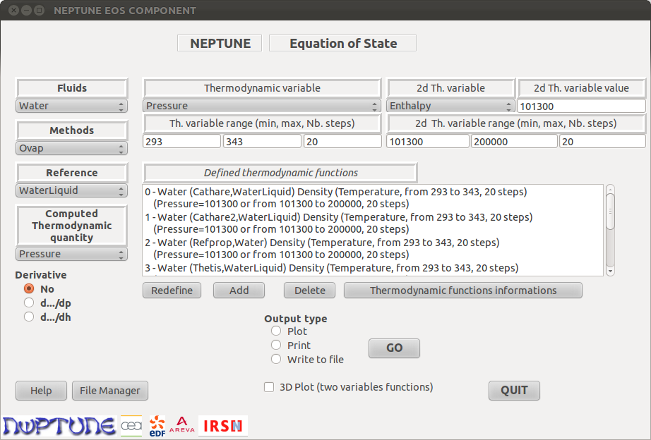
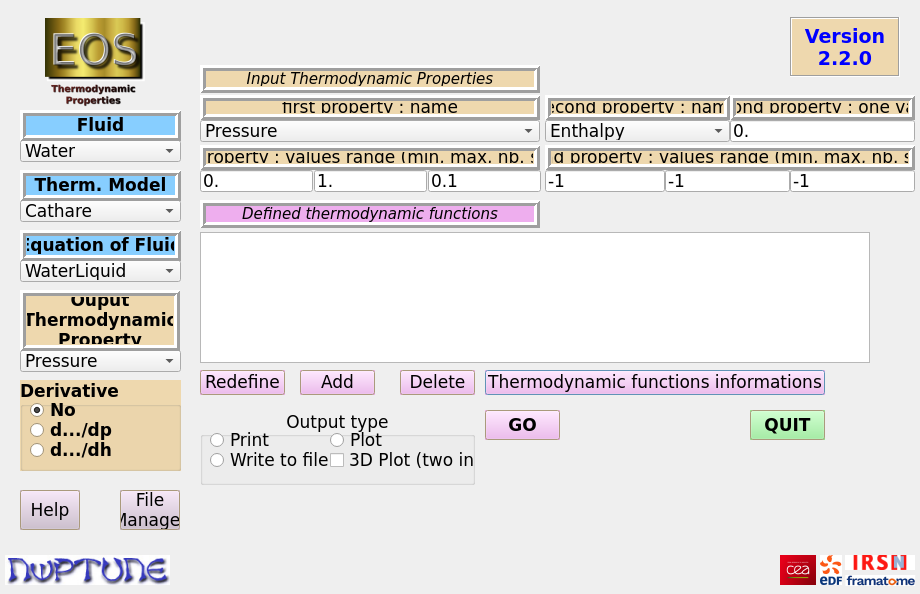

.. _eos-ihm:

Module EOS_IHM (interface graphique)
====================================

À quoi sert l'IHM
-----------------

Avant d'intégrer une méthode thermodynamique dans un code de calcul, on veut
en général la regarder : à quoi ressemble la masse volumique de l'eau le long
d'une isobare, où passe la courbe de saturation, de combien CATHARE2 et
REFPROP diffèrent sur la viscosité de la vapeur. ``Modules/EOS_IHM`` fournit
pour cela une petite application graphique, écrite en Python avec Qt, qui
permet de définir des *fonctions thermodynamiques* — une propriété, d'un
fluide, selon une méthode, le long d'un intervalle —, de les tracer seules ou
superposées, d'en afficher les valeurs et de les écrire dans des fichiers. Elle
ne demande aucune programmation. Pour des traitements plus élaborés (cartes,
calculs d'écarts, tables d'interpolation), l':ref:`API Python <api-python>`
prend le relais.

L'IHM est un outil de consultation : elle ne donne accès ni à
l':ref:`interpolateur <eos-igen>` en génération, ni aux
:ref:`mélanges <eos-mixing>`.

Prérequis et compilation
------------------------

L'IHM est construite par défaut. L'option CMake correspondante,
``WITH_GUI``, vaut ``ON`` ; on la pilote depuis ``configure`` par
``--with-gui`` et ``--without-gui``. (Le commentaire de ``user_env.txt`` qui
présente ``--without-gui`` comme le défaut est inexact.) La compilation
produit un module d'extension Python et a donc besoin de SWIG et des en-têtes
de développement de Python ; leur absence est une erreur fatale de
configuration (*« Swig is required to build GUI »*), à laquelle on remédie
soit en les installant, soit en configurant avec ``--without-gui``. Comme pour
l'API Python, ``--with-swig-exec``, ``--with-python-exec``,
``--with-python-lib`` et ``--with-python-include`` permettent de désigner des
versions particulières.

Deux dépendances ne sont nécessaires qu'à l'exécution et ne sont **pas**
vérifiées à la configuration : PyQt (la version 5 ou, à défaut, la version 4 :
le code essaie l'une puis l'autre) et ``gnuplot``, qui réalise les tracés.
Sans PyQt, le lancement échoue sur une ``ImportError`` ; sans gnuplot, tout
fonctionne sauf le tracé, et l'IHM ne le signale pas.

L'export au format MED des surfaces 3D est facultatif. Il est compilé si une
bibliothèque MED a été indiquée à la configuration (``--with-med=<chemin>``,
avec ``--with-hdf5=<chemin>`` dont MED dépend) ; sinon l'IHM se construit sans
cet export.

.. code-block:: bash

   ./configure --prefix=$PWD/install --with-gui \
               --with-med=/chemin/med --with-hdf5=/chemin/hdf5 ...
   cd build && make -j8 && make install

L'installation dépose le lanceur ``<prefix>/bin/eos_gui``, le module
d'extension ``<prefix>/lib/_eosihm.so``, les sources Python dans
``<prefix>/lib/python<X.Y>/site-packages/eos/`` et l'aide en ligne avec les
logos dans ``<prefix>/doc/Modules/EOS_IHM/``. Voir :doc:`../installation` pour
la procédure générale.

Lancer l'IHM
------------

.. code-block:: bash

   cd ~/mon_etude          # répertoire de travail, accessible en écriture
   <prefix>/bin/eos_gui

Le lanceur est un script shell qui complète ``LD_LIBRARY_PATH`` et
``PYTHONPATH`` puis exécute ``eosMain4.py`` avec l'interpréteur Python retenu
à la configuration ; il n'y a rien à régler à la main. Il ne prend aucun
argument. Le répertoire d'où on le lance a de l'importance, car c'est là que
l'IHM écrit tous ses fichiers et qu'elle cherche, au démarrage, la sauvegarde
de la session précédente.

Les listes de fluides et de méthodes proposées sont lues dans le fichier
``index.eos`` du répertoire de données d'EOS, cherché dans
``NEPTUNE_EOS_DATA``, puis ``USER_EOS_DATA``, puis ``<prefix>/data``. Si l'une
de ces variables pointe vers un répertoire sans ``index.eos``, l'IHM s'arrête
au démarrage sur une exception Python.

Si la bibliothèque a été configurée avec ``--without-gui``, le script
``eos_gui`` est tout de même installé ; il se borne alors à afficher
*« EOS GUI has not been chosen at configure stage »*.

Visite guidée de la fenêtre
---------------------------

La fenêtre principale, intitulée « NEPTUNE EOS COMPONENT », n'a ni menu ni
onglet : tout tient dans un seul panneau, en anglais. La capture
:ref:`ci-dessous <fig-ihm-capture>` est celle du guide historique
(``Doc/GUIGuide``) ; la disposition n'a pas changé depuis, mais plusieurs
libellés ont été renommés, et le tableau qui suit donne la correspondance.

.. _fig-ihm-capture:

   La fenêtre principale, avec quatre fonctions définies : la masse volumique
   de l'eau liquide entre 293 et 343 K à pression atmosphérique, selon quatre
   méthodes (capture du guide historique).

La lecture se fait en trois temps, qui sont aussi les trois temps du travail.

La **colonne de gauche** dit *quoi* calculer. De haut en bas : le fluide
(``Fluid``), la méthode thermodynamique (``Therm. Model``), l'équation fluide
(``Equation of Fluid``, par exemple ``WaterLiquid`` ou ``WaterVapor``) et la
propriété voulue (``Ouput Thermodynamic Property`` — la coquille est dans le
logiciel). Les trois premières listes sont liées : choisir un fluide restreint
les méthodes à celles qui le connaissent, choisir une méthode restreint les
équations. Le groupe ``Derivative`` permet de demander, au lieu de la
propriété, sa dérivée par rapport à la pression (``d.../dp``) ou à
l'enthalpie (``d.../dh``). En bas, ``Help`` ouvre l'aide en ligne et ``File
Manager`` un gestionnaire des fichiers produits.

La **zone supérieure droite**, ``Input Thermodynamic Properties``, dit *où*
calculer. La première propriété d'entrée (``first property : name``) est
celle qui varie : c'est l'abscisse du tracé, avec son intervalle et son
nombre de pas (``first property : values range (min, max, nb. steps)``). La
seconde (``second property : name``) est maintenue constante à la valeur
saisie dans ``second property : one value`` ; son propre intervalle (``second
property : values range``) ne sert que pour les tracés 3D. Il n'y a pas de
sélecteur de « plan thermodynamique » : le plan découle du couple choisi. Avec
``Pressure`` en première propriété, la seconde peut être ``Enthalpy`` ou
``Temperature`` ; avec ``Enthalpy`` ou ``Temperature`` en première, la seconde
est forcément ``Pressure``. Pour une propriété de saturation ou de limite
spinodale, qui ne dépend que d'une variable, la seconde liste se réduit
d'elle-même à ``at saturation`` ou ``at limit``. Toutes les valeurs sont en
unités SI.

La **zone inférieure droite** dit *quoi en faire*. Le bouton ``Add`` transforme
l'état courant des listes et des champs en une fonction, ajoutée à la liste
``Defined thermodynamic functions`` sous une forme lisible telle que :

.. code-block:: text

   0 - Water (Cathare2,WaterLiquid) Density (Temperature, from 293 to 343, 20 steps)
       (Pressure=101300 or from -1 to -1, -1 steps)

``Delete`` supprime les fonctions sélectionnées, ``Redefine`` recharge dans les
listes et les champs les paramètres de la fonction sélectionnée (une seule),
ce qui permet d'en créer une variante. Le groupe ``Output type`` offre trois
sorties — ``Plot``, ``Print``, ``Write to file`` — plus la case ``3D Plot
(two inputs)``. ``GO`` lance le calcul des fonctions sélectionnées ; ``QUIT``
ferme l'application en sauvegardant la session.

.. list-table:: Correspondance entre la capture historique et la version actuelle
   :header-rows: 1
   :widths: 50 50

   * - Libellé de la capture
     - Libellé actuel
   * - Fluids
     - Fluid
   * - Methods
     - Therm. Model
   * - Reference
     - Equation of Fluid
   * - Computed Thermodynamic quantity
     - Ouput Thermodynamic Property
   * - Thermodynamic variable
     - first property : name
   * - 2d Th. variable
     - second property : name
   * - 2d Th. variable value
     - second property : one value
   * - Th. variable range (min, max, Nb. steps)
     - first property : values range (min, max, nb. steps)
   * - 2d Th. variable range (min, max, Nb. steps)
     - second property : values range (min, max, nb. steps)
   * - 3D Plot (two variables functions)
     - 3D Plot (two inputs), désormais dans le groupe ``Output type``

Les cartouches « NEPTUNE » et « Equation of State » du haut de la capture ont
été remplacés par le logo EOS et le numéro de version, et les méthodes Ovap et
Thetis qu'on y voit ne sont plus distribuées. La figure
:ref:`suivante <fig-ihm-actuelle>` montre la version 2.2.0 au démarrage.

.. _fig-ihm-actuelle:

   La fenêtre de la version 2.2.0 à l'ouverture, avec ses valeurs par défaut
   (rendu hors écran : les libellés, de largeur fixe, y apparaissent plus
   tronqués que sur un poste de travail).

Trois détails de cette fenêtre au démarrage expliquent la plupart des faux
départs. Le champ du nombre de pas contient ``0.1``, qui n'est pas un entier :
``Add`` le refuse tant qu'on ne l'a pas corrigé. Aucun bouton du groupe
``Output type`` n'est coché : ``GO`` répond *« No Output Type selected »*. Et
la liste des fonctions fonctionne en sélection multiple par simple clic : un
clic sélectionne une ligne, un second clic la désélectionne, sans touche
Ctrl ; une fonction ajoutée n'est pas sélectionnée d'office.

Scénario 1 : tracer la courbe de saturation de l'eau
----------------------------------------------------

On veut la température de saturation de l'eau entre 1 et 150 bar, selon
CATHARE2.

#. Dans ``Fluid``, choisir ``Water`` (c'est le premier de la liste). Dans
   ``Therm. Model``, choisir ``Cathare2`` ; dans ``Equation of Fluid``,
   ``WaterLiquid``. La liste des méthodes dépend des greffons compilés.
#. Dans ``Ouput Thermodynamic Property``, choisir ``SaturatedTemperature``.
   La liste ``second property : name`` ne propose plus que ``at saturation``.
#. Dans ``first property : name``, laisser ``Pressure``. Choisir ``Enthalpy``
   provoquerait l'avertissement *« enthalpy is not allowed as variable for
   saturation quantities »*.
#. Dans les trois champs de ``first property : values range``, saisir
   ``1.e5``, ``150.e5`` et ``50``. Le troisième champ est un nombre de pas :
   50 pas donnent 51 points, bornes comprises. Laisser ``0.`` dans ``second
   property : one value`` — le champ est sans effet ici mais doit contenir un
   nombre.
#. Laisser ``Derivative`` sur ``No`` et cliquer sur ``Add``. La liste affiche
   ``0 - Water (Cathare2,WaterLiquid) SaturatedTemperature (Pressure, from
   1.e5 to 150.e5, 50 steps) (at saturation)``.
#. Cliquer sur cette ligne pour la sélectionner ; elle change de couleur.
#. Dans ``Output type``, cocher ``Plot``, en laissant ``3D Plot`` décoché (le
   3D est refusé pour les grandeurs de saturation), puis cliquer sur ``GO``.

Une fenêtre gnuplot s'ouvre avec la courbe ; elle reste ouverte et l'IHM
garde la main. Trois fichiers ont été créés dans le répertoire courant :
``eoscrb1.data`` (les points), ``don2.gpt`` (le script gnuplot) et
``eosplot1.ps`` (le tracé en PostScript). Le fichier de données commence
par :

.. code-block:: text

   100000.0 372.78
   398000.0 416.68...
   696000.0 437.85...

Pour obtenir l'enveloppe de saturation plutôt que la seule température, on
ajoute de la même façon ``SaturatedLiquidEnthalpy`` et
``SaturatedVaporEnthalpy`` (ou les deux masses volumiques), on sélectionne les
deux lignes, et ``GO`` les superpose. Pour la pression de saturation en
fonction de la température, on choisit ``SaturatedPressure`` avec
``Temperature`` en première propriété.

Scénario 2 : comparer deux méthodes sur une même propriété
----------------------------------------------------------

L'IHM n'a pas de fonction « comparer » : comparer, c'est définir une fonction
par méthode, puis les sélectionner ensemble. On reprend l'exemple de la
capture : la masse volumique de l'eau liquide à pression atmosphérique, de
293 à 343 K, selon CATHARE2 et REFPROP 10.

#. ``Fluid`` = ``Water``, ``Therm. Model`` = ``Cathare2``, ``Equation of
   Fluid`` = ``WaterLiquid``, ``Ouput Thermodynamic Property`` = ``Density``.
#. ``first property : name`` = ``Temperature`` ; la seconde propriété devient
   automatiquement ``Pressure``.
#. ``first property : values range`` = ``293``, ``343``, ``20`` ; ``second
   property : one value`` = ``101300``.
#. ``Add``. La fonction 0 apparaît dans la liste.
#. Changer seulement ``Therm. Model`` en ``Refprop10``. La liste des
   équations se recharge : y choisir ``WaterLiquid``. Les champs numériques
   sont conservés. ``Add`` : la fonction 1 apparaît.
#. Cliquer sur la ligne 0 puis sur la ligne 1.
#. ``Output type`` = ``Plot``, puis ``GO``.

Les deux courbes apparaissent sur un même graphique, légendées ``rho Water
(Cathare2, WaterLiquid) Pressure=101300`` et ``rho Water (Refprop10,
WaterLiquid) Pressure=101300``. À cette échelle elles sont presque
confondues ; pour chiffrer l'écart, on relance avec ``Output type`` =
``Print`` : une fenêtre « EOS PRINT » liste les deux tableaux de valeurs, où
on lit à 293 K 997,27 kg/m³ pour CATHARE2 et 998,24 kg/m³ pour REFPROP 10. Si
REFPROP n'a pas été compilé, n'importe quelle autre méthode de la liste fait
l'affaire (``Cathare``, ``StiffenedGas``…).

Deux limites sont à garder en tête. Le script gnuplot définit huit styles de
courbe, ce qui borne en pratique le nombre de fonctions superposées. Et
l'axe des abscisses est légendé d'après la première fonction sélectionnée,
sans vérifier que les autres ont la même variable : superposer une fonction de
la température et une fonction de la pression donne un graphique dénué de
sens, sans avertissement.

Tracés 3D
---------

Pour visualiser une propriété sur un domaine à deux variables, on remplit
aussi, *avant* ``Add``, l'intervalle de la seconde propriété (par exemple
``101300``, ``200000``, ``20``), on sélectionne une seule fonction, et on
coche ``Plot`` et ``3D Plot (two inputs)``. gnuplot affiche une surface
colorée que l'on peut faire tourner à la souris. Contrairement au tracé 2D,
gnuplot est ici lancé de façon bloquante : l'IHM est gelée jusqu'à ce que
l'on appuie sur Entrée **dans le terminal** d'où elle a été lancée (gnuplot y
affiche *« Hit return to continue »*). Il faut donc lancer ``eos_gui`` depuis
un terminal interactif pour utiliser le 3D.

L'intervalle de la seconde propriété n'est pas contrôlé à la saisie. Avec les
valeurs par défaut ``-1``, ou avec des bornes égales, le calcul 3D échoue, et
dans le second cas l'export MED interrompt brutalement l'application.

Résultats et fichiers produits
------------------------------

Quelle que soit la sortie choisie, chaque fonction calculée est écrite dans un
fichier ``eoscrb<k>.data``, où ``k`` est le premier entier libre : l'IHM
n'écrase jamais un fichier de données existant. ``Write to file`` s'en tient
là.

.. list-table:: Fichiers écrits dans le répertoire courant
   :header-rows: 1
   :widths: 26 22 52

   * - Fichier
     - Écrit par
     - Contenu
   * - ``eoscrb<k>.data``
     - toutes les sorties
     - En 2D, une ligne « abscisse valeur » par point. En 3D, quatre lignes
       d'en-tête commençant par ``#`` puis des triplets, par blocs séparés
       d'une ligne vide (format ``splot`` de gnuplot).
   * - ``eosplot<k>.ps``
     - ``Plot``
     - Le tracé en PostScript couleur. C'est le seul format d'image ; on le
       convertit au besoin avec ``ps2pdf`` ou ImageMagick.
   * - ``don2.gpt``
     - ``Plot``
     - Le script gnuplot du dernier tracé (écrasé à chaque fois). Le modifier
       et le rejouer avec ``gnuplot -persist don2.gpt`` est le moyen le plus
       simple de changer un titre, une échelle ou un format de sortie.
   * - ``eosprint.output``
     - ``Print``
     - Le texte affiché dans la fenêtre « EOS PRINT » (écrasé à chaque fois).
   * - ``eoscrb<k>.med``
     - 3D, si MED est compilé
     - Une grille cartésienne 2D et un champ aux nœuds portant le nom de la
       propriété, lisible dans SALOME ou ParaView. Les coordonnées y sont
       **normalisées** (abscisses ramenées à [0, 1]) pour la lisibilité du
       rendu : elles ne portent pas les valeurs physiques.
   * - ``le_fichier_des_erreurs``
     - chaque calcul
     - La trace du gestionnaire d'erreurs d'EOS, vide en l'absence de
       problème.
   * - ``eosGUI.<USER>.save``
     - ``QUIT``
     - La session : fonctions définies, sélection et champs numériques.

Lorsqu'un calcul sort du domaine de validité de la méthode, une fenêtre « EOS
ERROR » affiche le diagnostic d'EOS et une fenêtre « EOS PRINT » le contenu de
``le_fichier_des_erreurs`` ; en 2D, les points valides sont néanmoins tracés et
les points fautifs simplement omis. Ces fenêtres secondaires, comme celle de
l'aide, sont indépendantes : c'est à l'utilisateur de les fermer.

La session n'est sauvegardée que par le bouton ``QUIT`` ; fermer la fenêtre
par la croix du gestionnaire de fenêtres perd les fonctions définies. Les
choix des listes déroulantes et du type de sortie ne sont pas conservés.

Problèmes fréquents
-------------------

.. list-table::
   :header-rows: 1
   :widths: 42 58

   * - Symptôme
     - Cause et remède
   * - *« The number of steps of the variable range is not an integer »* au
       premier ``Add``
     - Le champ du nombre de pas vaut ``0.1`` par défaut. Y saisir un entier.
   * - *« No Output Type selected »*
     - Cocher ``Plot``, ``Print`` ou ``Write to file`` avant ``GO``.
   * - *« No Function selected »*
     - Une fonction ajoutée n'est pas sélectionnée : cliquer sur sa ligne.
   * - ``GO`` en mode ``Plot`` ne montre rien, mais ``eoscrb<k>.data`` est
       écrit
     - gnuplot n'est pas installé ou pas dans le ``PATH`` ; le message du
       shell n'apparaît que dans le terminal.
   * - L'IHM ne répond plus après un tracé 3D
     - gnuplot attend un appui sur Entrée dans le terminal de lancement.
   * - Exception Python au démarrage mentionnant ``index.eos``
     - ``NEPTUNE_EOS_DATA`` (prioritaire) ou ``USER_EOS_DATA`` désigne un
       répertoire qui n'est pas un répertoire de données EOS.
   * - Exception au démarrage ou au ``GO`` juste après une mise à jour
     - Le fichier ``eosGUI.<USER>.save`` du répertoire courant vient d'une
       version antérieure. Le supprimer.
   * - Trace ``KeyError`` dans le terminal en traçant ``Gamma``
     - Cette propriété n'a pas d'abréviation dans le module de tracé.
       ``Print`` et ``Write to file`` fonctionnent.
   * - Dans le ``File Manager``, ``Filter`` et ``Delete`` ferment la fenêtre
     - Sous Python 3, ces deux boutons sont reliés par erreur à l'action du
       bouton ``QUIT`` (``eosFileManager.py``). Gérer les fichiers depuis le
       shell en attendant la correction.
   * - Messages *« ---On a un probleme »* dans le terminal
     - Sans gravité : avec une locale dont le séparateur décimal est la
       virgule, l'IHM bascule en locale ``C`` et le signale ainsi.
   * - À saturation, ``d.../dh`` donne la même chose que ``d.../dp``
     - Voulu : les grandeurs de saturation ne sont dérivées que par rapport à
       la pression.

Architecture
------------

L'IHM est organisée en trois couches, que le diagramme de classes
:ref:`ci-dessous <fig-ihm-classes>` sépare par une ligne de cadres : une
application Python/Qt, une frontière SWIG réduite à une classe, et la
bibliothèque EOS. Elle ne dépend pas de l':ref:`API Python <api-python>`
générale : elle possède son propre module d'extension, ``eosihm``, construit
même lorsque ``--with-python-api`` n'est pas demandé.

.. _fig-ihm-classes:

.. graphviz::
   :caption: Diagramme de classes de l'IHM. En haut les classes Python de
             ``Modules/EOS_IHM/qt``, au milieu la classe C++ ``EosIhm``
             exposée par SWIG (module ``eosihm``), en bas la bibliothèque EOS
             et l'export MED.

   digraph ihm_classes {
       rankdir=TB;
       node [shape=record, fontname="Helvetica", fontsize=10,
             style=filled, fillcolor="#eef3fa"];
       edge [fontname="Helvetica", fontsize=9, arrowhead=vee];

       subgraph cluster_py { label="Python / Qt  (Modules/EOS_IHM/qt)"; color="#bbbbbb";
           Main [label="{Ui_NEPTUNE_EOS (eosGUI4a)|definedFunction\ldetailOfFunction\lselectedFunction\l|+ AddButton_clicked()\l+ DeleteButton_clicked()\l+ RedefButton_clicked()\l+ GoButton_clicked()\l+ QuitButton_clicked()\l+ Fluid_changed()\l+ Method_changed()\l+ Quantity_changed()\l}"];
           Ava  [label="{EosAvailable (eosAva)|+ whichFluids()\l+ which_thmodel()\l+ which_fldeq()\l+ whichThQuantities()\l+ set_thmodel(fluid)\l+ set_fldeq(fluid, thmodel)\l}"];
           Util [label="{eosUtil (eosUtil)|+ buildIndexDict()\l+ buildPropDict()\l}"];
           Run  [label="{EosRun (eosRunFunction)|+ getNewFileName(pref, post, k)\l+ sortAnError(objv, parent)\l}"];
           Comp [label="{EosComponent (eosComponent)|+ compute(objv)\l}"];
           Win  [label="{Fenêtres secondaires|Ui_Form2 (eosHelp4)\lUi_Form3, Ui_Form4 (eosPrint4)\lUi_FileManager (eosFileManager)\l}"];
       }
       subgraph cluster_swig { label="SWIG  (eosihm.i : module eosihm, _eosihm.so)"; color="#bbbbbb";
           Ihm [fillcolor="#fff6d6", label="{EosIhm (eosihmSrc1.hxx)|- value : double*\l- the_error_field : int*\l|+ initValueByStep(a, b, n)\l+ computeValue(meth, ref, var, qty, par2, val2)\l+ getNumberOfValue()\l+ getValueAsList(n)\l+ getErrorAsList(n)\l+ getTheErrorI()\l+ getTheErrorC()\l+ putTheArrays(x, y, z, nx, ny, nz, ...)\l}"];
       }
       subgraph cluster_cpp { label="C++ / Fortran"; color="#bbbbbb";
           EOS [label="{NEPTUNE::EOS|+ compute(EOS_Field, EOS_Field, EOS_Field, EOS_Error_Field)\l+ compute(EOS_Field, EOS_Field, EOS_Error_Field)\l+ set_error_handler(...)\l}"];
           Med [label="{eos2med (Fortran)|bibliothèque MED\l}"];
       }
       GP [shape=box, style="rounded,filled", fillcolor="#e8f5e2", label="gnuplot\n(processus externe)"];

       Main -> Ava  [label="possède"];
       Ava  -> Util [label="utilise"];
       Main -> Run  [label="crée sur GO"];
       Main -> Win  [label="ouvre"];
       Run  -> Comp [label="crée"];
       Run  -> Win  [label="résultats, erreurs"];
       Run  -> Ihm  [label="crée"];
       Comp -> Ihm  [label="computeValue"];
       Run  -> GP   [label="os.system"];
       Ihm  -> EOS  [label="crée, appelle"];
       Ihm  -> Med  [label="putTheArrays"];
   }

Côté Python, ``eosMain4.py`` n'est qu'un point d'entrée : il crée
l'application Qt et la fenêtre ``Ui_NEPTUNE_EOS`` du module ``eosGUI4a``, qui
porte tous les widgets et tout l'état (la liste des fonctions définies et
leurs paramètres). Le contenu des listes déroulantes vient de
``EosAvailable``, qui s'appuie sur ``eosUtil`` pour lire ``index.eos`` —
d'où un dictionnaire fluide → méthode → équations — et
``index.eos.properties`` pour les noms longs et courts des propriétés. Un
clic sur ``GO`` crée un objet ``EosRun``, dont le constructeur fait tout le
travail : calcul, écriture des fichiers, lancement de gnuplot ou ouverture
des fenêtres de texte. La traduction d'une fonction de l'IHM en appel EOS
est confiée à ``EosComponent`` : passage des noms longs aux noms courts,
ajout du préfixe ``EOS_`` à la méthode, construction du nom de la dérivée
(``d_rho_d_p_h``…), cas particuliers de la saturation et de la limite. Les
fichiers suffixés ``.py.in`` sont instanciés par CMake, qui y inscrit les
chemins d'installation et le numéro de version.

La frontière SWIG est volontairement étroite. Le fichier ``eosihm.i`` expose
une seule classe, ``EosIhm``, avec des *typemaps* qui convertissent les
tableaux C en listes Python et inversement. ``EosIhm`` garde un tableau de
valeurs : ``initValueByStep`` le remplit avec les abscisses, ``computeValue``
le remplace par les résultats, ``getValueAsList`` le rend à Python.

C'est dans ``computeValue`` que se fait la rencontre avec la bibliothèque. La
méthode installe un :cpp:class:`NEPTUNE::EOS_Std_Error_Handler` configuré pour
lever une exception à partir du niveau ``bad`` et tracer à partir du niveau
``ok`` dans ``le_fichier_des_erreurs`` (voir :doc:`../usage/errors`),
construit un objet :cpp:class:`NEPTUNE::EOS` à partir des noms de méthode et
d'équation, enveloppe les tableaux dans des :cpp:class:`NEPTUNE::EOS_Field`,
puis appelle ``compute`` par champ, à une entrée pour la saturation et la
limite, à deux entrées sinon (voir :doc:`../usage/fields`). Une
``EOS_Std_Exception`` est rattrapée et convertie en un indicateur et un
message que Python relit par ``getTheErrorI`` et ``getTheErrorC``.

Le diagramme de séquence :ref:`suivant <fig-ihm-sequence>` reprend ce
parcours pour un tracé 2D.

.. _fig-ihm-sequence:

.. graphviz::
   :caption: Séquence d'un clic sur ``GO`` jusqu'à l'affichage de la courbe
             (tracé 2D). Les étapes 4 à 9 sont répétées pour chaque fonction
             sélectionnée.

   digraph ihm_sequence {
       rankdir=TB;
       node [shape=box, fontname="Helvetica", fontsize=10,
             style=filled, fillcolor="#eef3fa"];
       edge [fontname="Helvetica", fontsize=9];

       s1 [label="1. Utilisateur : clic sur GO\nUi_NEPTUNE_EOS.GoButton_clicked()"];
       s2 [label="2. Contrôles : sélection non vide, type de sortie choisi,\npas de 3D à saturation"];
       s3 [label="3. EosRun(parent, selectedFunction, detailOfFunction, \"plot\", ava, plot3D)\nobjv = eosihm.EosIhm()"];
       s4 [label="4. objv.initValueByStep(min, max, n)\nx = objv.getValueAsList(n+1)"];
       s5 [label="5. EosComponent(detail, ava).compute(objv)\nnoms courts, préfixe EOS_, nom de la dérivée"];
       s6 [fillcolor="#fff6d6", label="6. [SWIG] EosIhm::computeValue(meth, ref, var, qty, par2, val2)"];
       s7 [label="7. [C++] new EOS(meth, ref) ; set_error_handler(handler)\nEOS_Field f1, f3, f2 ; EOS_Error_Field err\nmyphase->compute(f1, f3, f2, err)"];
       s8 [label="8. y = objv.getValueAsList(n)\nEosRun.sortAnError(objv, parent) : fenêtres EOS ERROR / EOS PRINT,\nfiltrage des points en erreur"];
       s9 [label="9. Écriture de eoscrb<k>.data"];
       s10 [label="10. Écriture de don2.gpt\nos.system(\"gnuplot -persist don2.gpt &\")"];
       s11 [fillcolor="#e8f5e2", label="11. gnuplot : fenêtre de tracé et eosplot<k>.ps\nL'IHM reste active"];

       s1 -> s2 -> s3 -> s4 -> s5 -> s6 -> s7 -> s8 -> s9 -> s10 -> s11;
       s9 -> s4 [style=dashed, label="fonction suivante"];
   }

Deux conséquences pratiques de cette architecture : un objet ``EOS`` est
reconstruit à chaque appel de ``computeValue`` — donc à chaque ligne d'une
surface 3D, ce qui rend les tracés 3D lents avec les méthodes dont
l'initialisation est coûteuse —, et le calcul est synchrone, l'interface étant
figée pendant sa durée.

En 3D, ``EosRun`` boucle en Python sur les valeurs de la seconde propriété,
puis transmet la grille complète à ``putTheArrays``, qui appelle la routine
Fortran ``eos2med`` (``cpp/med/eos2med.f``) lorsque MED est disponible.

Le guide historique ``Doc/GUIGuide/desfonc.tex`` reste une bonne description
du rôle de chaque méthode d'``EosIhm`` et de chaque module Python. Il est en
revanche daté sur l'environnement : il parle de Qt4 seulement, d'un module
``eosGUI4`` (devenu ``eosGUI4a``), de logos et de fichiers d'information par
méthode (``eosCathareInfo.txt``…) qui n'existent plus — le bouton
``Thermodynamic functions informations`` n'affiche plus aujourd'hui qu'un
texte d'une ligne. Le ``README`` du module est marqué obsolète, et l'aide en
ligne nomme le fichier de session ``eosGUI.save`` alors qu'il s'appelle
``eosGUI.<USER>.save``.
